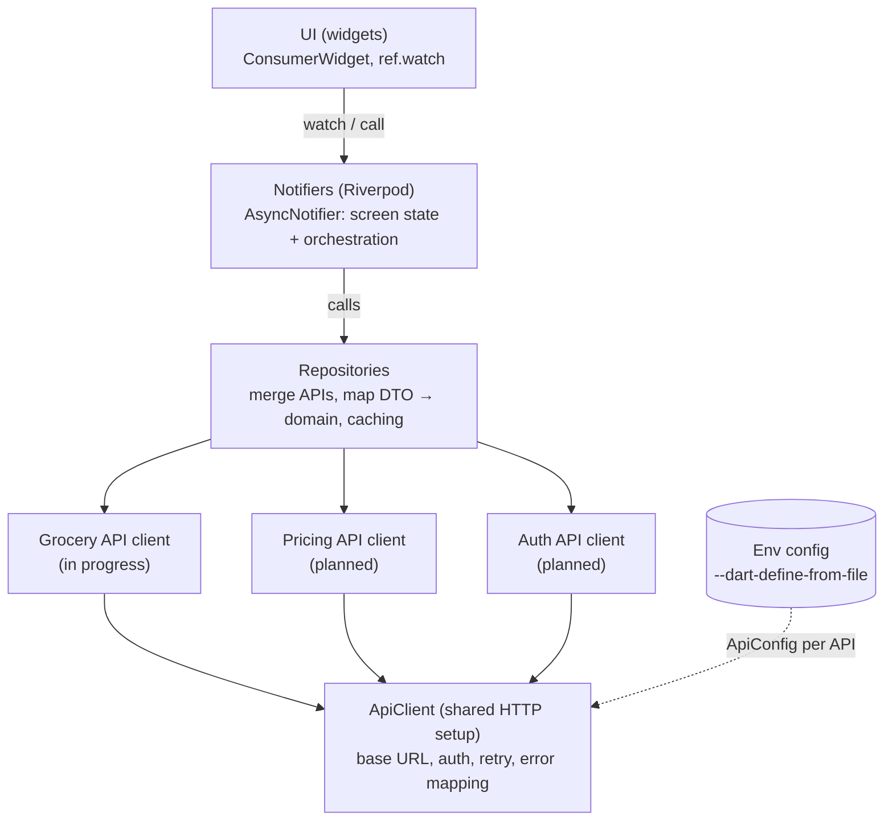
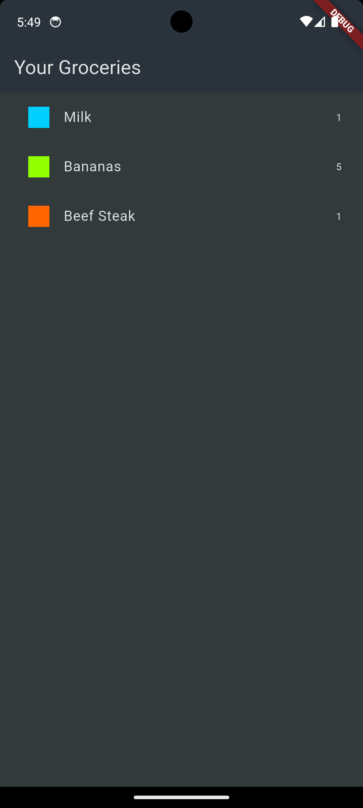
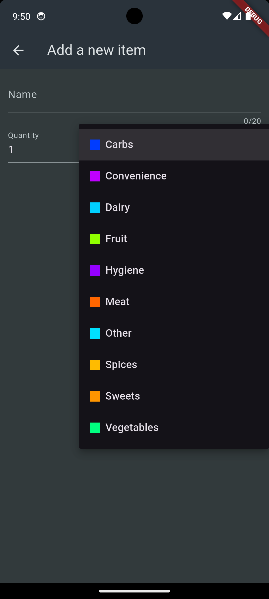
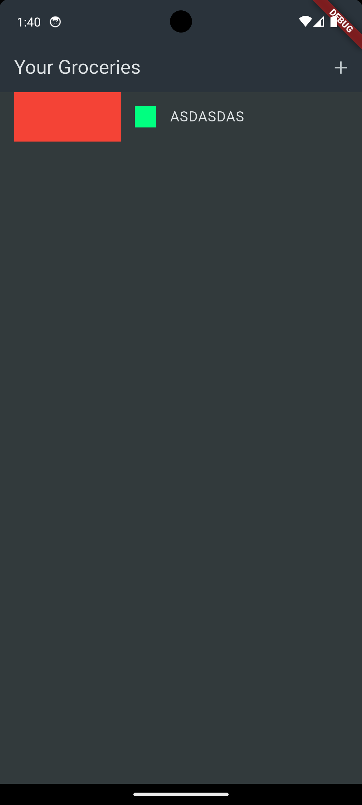

<p align="center">
  
</p>

# Shopmate

A Flutter practice project focused on **form handling**, built around a groceries list app (repository: `groceries_app`). CI workflow based on meal-app.

## Form handling

The "Add a new item" screen ([lib/widgets/new_item.dart](lib/widgets/new_item.dart)) uses Flutter's built-in form tools, with no third-party form package:

- `Form` with a `GlobalKey<FormState>` to validate, save and reset all fields at once
- `TextFormField` for the name, with a `validator` (2 to 20 characters) and `maxLength`
- `TextFormField` for the quantity, with a numeric keyboard, a digits-only input formatter and a positive-number validator
- `DropdownButtonFormField` for the category, with a color marker on each option
- `onSaved` to collect the values, then `Navigator.pop` to return the new `GroceryItem` to the list screen
- A **Reset** button (`FormState.reset()`) and an **Add Item** button that only submits when the form is valid

## Other features

- View your grocery list, with a colored category marker and quantity per item
- The list is loaded from the API, with a loading spinner, an error state with **Retry**, and an empty state
- Pull down to refresh the list (or use the refresh button in the app bar); a thin progress bar shows while it reloads
- Add an item through the form; it is saved to the API
- Swipe an item away to delete it (removed from the list immediately, rolled back if the request fails)
- Tap **Undo** in the snackbar to restore a deleted item to its original position

## Backend (local API)

The app is moving off Firebase and onto our own backend, the NestJS service in [../api](../api), running locally on `localhost` for now.

- The API listens on port `3000` by default (`IP` and `PORT` are set in `api/.env`).
- It exposes plain REST at the root: `GET /` (list), `POST /` (create), and `GET`/`PUT`/`DELETE /:id`. Items are `{ id, name, quantity, category }`, with UUID ids.
- Items are kept in memory and start with 5 seed items. `POST` adds to the list; `PUT` and `DELETE` are still stubs that don't change it, so a deleted item returns on the next fetch. Everything resets when the API restarts.
- The app's base URL is set with `--dart-define=API_URL=...` and defaults to `http://10.0.2.2:3000` (the Android emulator). For example:
  ```bash
  flutter run --dart-define=API_URL=http://192.168.1.7:3000
  ```
- On the Android emulator, `localhost` is the emulator itself, so use `10.0.2.2` to reach the host machine. The iOS simulator and desktop/web builds can use `localhost` directly.
- A physical device needs the machine's LAN address instead, for example `http://192.168.1.7:3000`.

Start the API first (from `api/`, `yarn start:dev`), then run the app.

> **Next:** the app will be linked to a **serverless API** soon. The backend is intentionally swappable: only the API client layer knows which backend it talks to, so moving from the local NestJS service (or the old Firebase client) to a serverless one only changes that client and its base URL config, not the repositories, notifiers or widgets.

> **Status:** the app talks to the local NestJS API. The old Firebase client (`data/grocery_api.dart`) and the dummy items were removed.

## Architecture (in progress)

We are moving the app to a layered architecture because **it is going to integrate multiple APIs**, and we don't want any of them leaking into the UI. **The Grocery API is already built this way (see "Current structure" below); the rest of this section is the wider target design.**

### Current structure

```
lib/
  models/        # domain models: GroceryItem, Category
  data/          # static data (categories)
  services/      # GroceryApiService (HTTP only) + dto/GroceryItemDto (typed JSON)
  repositories/  # GroceryRepository: DTO <-> domain model
  providers/     # Riverpod: service, repository and groceryListProvider (AsyncNotifier)
  screens/       # GroceryListScreen (ConsumerWidget)
  widgets/       # NewItem form (ConsumerStatefulWidget)
```

`UI → providers → repository → service → HTTP`. Widgets only watch and call providers; they never import a repository, service or `http`.

- **Service** ([lib/services](lib/services)): URLs, headers, status checks and JSON. Takes and returns `GroceryItemDto`, the only place raw JSON is read (`fromJson`). Throws `GroceryApiException`.
- **Repository** ([lib/repositories](lib/repositories)): maps DTOs to `GroceryItem` and back. An unknown category name falls back to "Other".
- **Provider** ([lib/providers](lib/providers)): `groceryListProvider` loads the list (`build`) and offers `add`, `remove` and `restore` (used by Undo). Updates are optimistic and roll back on failure. `update` is still a TODO.
- **Refresh:** `ref.invalidate` / `ref.refresh` rerun `build()`. While refreshing, the old list stays visible (`AsyncValue.isRefreshing`).

> **Temporary:** `build()` in [grocery_providers.dart](lib/providers/grocery_providers.dart) has a 2-second `Future.delayed` so the loading spinner is visible. It is marked `TODO: remove`.

> **Known gaps:** the widget tests in [test/widget_test.dart](test/widget_test.dart) still target the old behavior and need a `ProviderScope` with a fake repository; the form still reads the static `categories` map directly instead of through a provider; there is no request timeout or friendly network-error message yet.

Planned API integrations (names are placeholders until each one is picked):

| API | Purpose | Status |
|---|---|---|
| **Grocery** | Shopping list CRUD (the NestJS service in [../api](../api) for now, to be linked to a serverless API soon) | In progress |
| **Pricing** | Price lookups to enrich list items | Planned |
| **Auth** | Sign-in and tokens used by the other clients | Planned |

Each API gets its own client, DTOs and config (base URL, timeout, auth strategy), and repositories are where data from several APIs is combined.



Calls flow down and data flows back up as `AsyncValue` / `Result`. Each layer only knows about the one directly below it.

| Layer | Owns | Does not know about |
|---|---|---|
| **Widgets** | Rendering, `ref.watch`, user events | HTTP, JSON, repositories |
| **Notifiers** | Screen state (`AsyncValue`), calling repository methods, optimistic updates | Endpoints, DTOs |
| **Repositories** | Combining APIs, mapping DTOs to domain models, caching, partial-failure rules | Widgets, Riverpod |
| **API clients** | URLs, headers, status checks, JSON parsing into DTOs | Domain models, UI |

Riverpod is also the wiring between layers: providers inject each API client into its repository, and each repository into its notifier. Repositories and API clients stay plain Dart and take dependencies through their constructors, so they can be tested with fakes.

### Planned layout

```
lib/
  core/        # env + ApiConfig, shared ApiClient, Result, failures
  apis/        # one folder per external API (client + DTOs)
  features/    # per feature: data/ (repository), domain/ (models), ui/
```

Rule: `features/` reaches `apis/` only through a repository, and `apis/` never imports from `features/`.

### Configuration

Today the only setting is `API_URL`, passed with `--dart-define` (see "Backend" above). The plan for more APIs is that base URLs and other per-environment values come from a JSON file per environment, read through a typed `Env` class and grouped into an `ApiConfig` per API:

```bash
flutter run --dart-define-from-file=config/dev.json
```

These values are compiled into the app, so they are fine for URLs but not for secrets. Keep `config/*.json` out of git and commit a `config/example.json` instead.

## Screenshot

<table>
  <tr>
    <td width="33%"></td>
    <td width="33%"></td>
    <td width="33%"></td>
  </tr>
</table>

## Getting Started

This project is a starting point for a Flutter application.

A few resources to get you started if this is your first Flutter project:

- [Learn Flutter](https://docs.flutter.dev/get-started/learn-flutter)
- [Write your first Flutter app](https://docs.flutter.dev/get-started/codelab)
- [Flutter learning resources](https://docs.flutter.dev/reference/learning-resources)

For help getting started with Flutter development, view the
[online documentation](https://docs.flutter.dev/), which offers tutorials,
samples, guidance on mobile development, and a full API reference.
